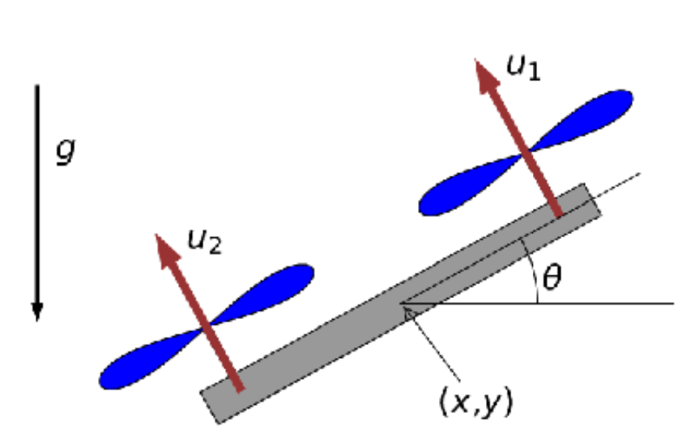

# Project 1 — Optimal Control of a 2D Quadrotor


[](iLQR.pdf)

> Build controllers of increasing complexity to make a 2D quadrotor perform acrobatic maneuvers — from hovering to a full flip — using LQR and iterative LQR (iLQR). Part of NYU ROB-GY 6323.

---

## The Robot



A planar quadrotor with two rotors. State and control vectors:

| Symbol | Description |
|---|---|
| `x, vx` | Horizontal position and velocity |
| `y, vy` | Vertical position and velocity |
| `θ, ω` | Orientation (pitch) and angular velocity |
| `u₁, u₂` | Thrust from left and right propellers |

**Parameters:** m = 0.6 kg · r = 0.2 m · I = 0.15 kg·m² · g = 9.81 m/s² · Δt = 0.01 s

**Continuous dynamics:**

$$\dot{x} = v_x, \quad m\dot{v}_x = -(u_1+u_2)\sin\theta, \quad \dot{y} = v_y$$
$$m\dot{v}_y = (u_1+u_2)\cos\theta - mg, \quad \dot{\theta} = \omega, \quad I\dot{\omega} = r(u_1-u_2)$$

**Hover control** (robot at rest): $u_1^* = u_2^* = \frac{mg}{2}$

---

## Part 1 — Setting Up

- Discretised the continuous dynamics using Euler integration with step Δt
- Derived the hover control $u^*$ such that the robot stays at rest at any $(x_0, y_0)$
- The linearisation of the discrete dynamics yields Jacobians **A** (state) and **B** (control), computed symbolically via `sympy` and converted to fast NumPy functions with `lambdify`

---

## Part 2 — LQR to Stay in Place

Designed an **infinite-horizon LQR** controller that keeps the robot at a fixed position even under random wind disturbances.

The Riccati recursion is iterated until convergence, producing a gain matrix **K** such that:

$$u_n = K\, z_n$$

| Without disturbances | With disturbances |
|---|---|
|  |  |

| Control — no disturbance | Control — with disturbance |
|---|---|
|  |  |

| Animation — no disturbance | Animation — with disturbance |
|---|---|
|  |  |

---

## Part 2 — LQR (Extended: Task 2)

| Without disturbances | With disturbances |
|---|---|
|  |  |

| Control a | Control b |
|---|---|
|  |  |

| Animation a | Animation b |
|---|---|
|  |  |

---

## Part 3 — Trajectory Tracking with Time-Varying LQR

Extended LQR to track a **circular trajectory** of radius 1 centred at the origin, with orientation θ = π/4. The linearisation is recomputed at each point along the desired trajectory, and a time-varying gain sequence is solved backward from the terminal cost.

$$z_{\text{ref}}(t) = [\cos(\omega t),\; -\omega\sin(\omega t),\; \sin(\omega t),\; \omega\cos(\omega t),\; \theta_{\text{ref}},\; 0]$$

### θ = π/4 variant

| Without disturbances | With disturbances |
|---|---|
|  |  |

| Control a | Control b |
|---|---|
|  |  |

| Animation a | Animation b |
|---|---|
|  |  |

### θ = 0 variant

| Without disturbances | With disturbances |
|---|---|
|  |  |

| Control a | Control b |
|---|---|
|  |  |

| Animation a | Animation b |
|---|---|
|  |  |

---

## Part 4 — Iterative LQR (iLQR)

iLQR optimises both the trajectory and the controller simultaneously — no reference trajectory is prescribed. At each iteration:

1. **Backward pass** — compute time-varying feedback gains **K** and feedforward corrections **k** via a Riccati-like recursion along the current trajectory
2. **Forward pass with line search** — update trajectory using $u_n \leftarrow u_n + \alpha k_n + K_n \delta z_n$, halving α until the cost decreases

### Task 1 — Reach θ = π/2 at (x=3, y=3) at t=5, return to origin at T=10

| State trajectory | Control trajectory |
|---|---|
|  |  |

| Animation |
|---|
|  |

### Task 2 — Full Flip (θ: 0 → π → 2π)

Reach upside-down state (x=1.5, y=3, θ=π) at t=5, complete the flip to (x=3, y=0, θ=2π) at T=10.

| State trajectory | Control trajectory |
|---|---|
|  |  |

| Animation |
|---|
|  |

---

## Files

```
Project1 - Optimal Control/
├── quadrotor.py                          # Quadrotor environment: dynamics, simulate, animate
├── get_linearization.py                  # Symbolic linearization (A, B Jacobians via sympy)
├── iterative LQR to control a drone.ipynb  # Assignment sheet (Parts 1–4 tasks)
├── Part 2.ipynb                          # Infinite-horizon LQR controller
├── Part 3.ipynb                          # Time-varying LQR — circular trajectory tracking
├── Part 4.ipynb                          # iLQR — acrobatic maneuvers (Task 1 & 2)
├── iLQR.pdf                              # Full written report
├── test.py                               # Standalone test script
└── data_viz/                             # Saved plots and animations (a = no disturbance, b = with disturbance)
```

---

## Course

**NYU ROB-GY 6323** — Reinforcement Learning and Optimal Control for Robotics  
Instructor: [Ludovic Righetti](https://engineering.nyu.edu/faculty/ludovic-righetti)
