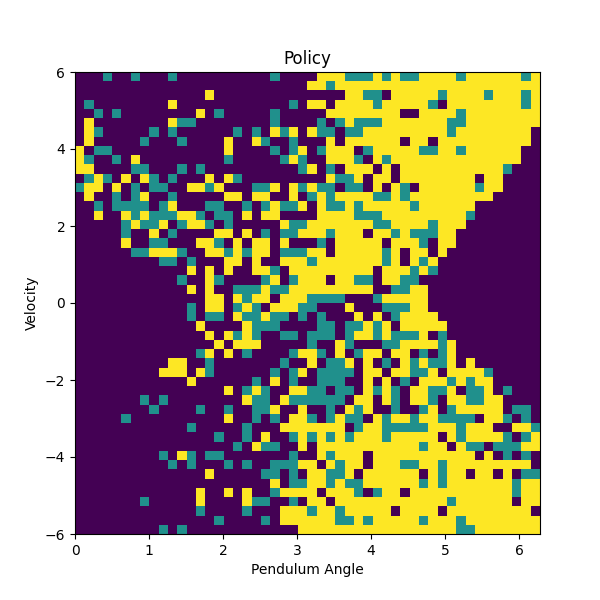
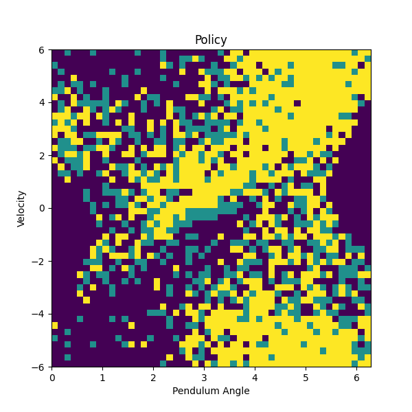
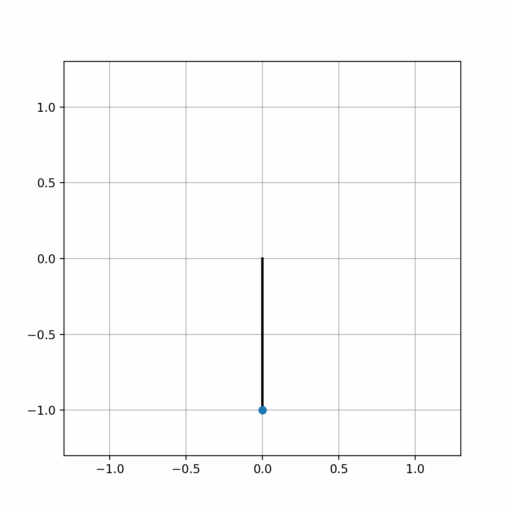

# Project 2 — Q-Learning: Inverted Pendulum


[](Q_Learning_Report.pdf)

> Learn a swing-up policy for an inverted pendulum using tabular Q-learning. Part of NYU ROB-GY 6323 — Reinforcement Learning and Optimal Control for Robotics.

---

## Goal

Train a Q-learning agent to swing a pendulum from its resting downward position (θ = 0) up to the inverted position (θ = π) and hold it there. Two action space configurations are compared to evaluate the effect of torque limits on learning performance.

---

## Environment

The pendulum environment is defined in `pendulum.py`:

| Property | Value |
|---|---|
| State space | `[θ, ω]` — angle and angular velocity |
| State bounds | θ ∈ [0, 2π], ω ∈ [−6, 6] rad/s |
| Integration step (Δt) | 0.1 s |
| Physics | Euler integration with gravity (g = 9.81) and damping |

Key functions:
- `get_next_state(x, u)` — integrates the pendulum one step forward
- `simulate(x0, policy, T)` — runs a full episode given a policy
- `animate_robot(x)` — renders an MP4 animation of the pendulum trajectory

---

## Q-Learning Setup

**State discretization:** 50 × 50 grid
- θ: 50 equally spaced points over [0, 2π]
- ω: 50 equally spaced points over [−6, 6]

**Q-table shape:** `(3, 50, 50)` — one entry per (action, θ, ω)

**Cost function:**

$$C(\theta, \dot\theta, u) = (\theta - \pi)^2 + 0.01\,\dot\theta^2 + 0.0001\,u^2$$

**Hyperparameters:**

| Parameter | Value |
|---|---|
| Episodes | 6,500 |
| Timesteps per episode | 100 |
| ε (exploration) | 0.1 |
| γ (discount) | 0.1 |
| α (learning rate) | 0.99 |

---

## Experiments

Two notebooks compare different torque limits on the action space:

| Notebook | Controls (torque) | Description |
|---|---|---|
| `-404.ipynb` | `[−3, 0, 3]` | Lower torque limits |
| `-505.ipynb` | `[−5, 0, 5]` | Higher torque limits |

Both use `np.random.choice` with epsilon-greedy action selection and save all outputs to `data_viz/`.

---

## Results

### Learning Progress

| -404 | -505 |
|---|---|
|  |  |

### Learning Progress with Curve Fitting

| -404 | -505 |
|---|---|
|  |  |

### Policy & Value Function

| Policy -404 | Policy -505 |
|---|---|
|  |  |

| Value Function -404 | Value Function -505 |
|---|---|
|  |  |

### Pendulum Trajectory

| θ and ω vs time -404 | θ and ω vs time -505 |
|---|---|
|  |  |

| Control vs time -404 | Control vs time -505 |
|---|---|
|  |  |

### Animations

| -404 | -505 |
|---|---|
|  |  |

---

## Files

```
Project2 - Reinforcement Learning/
├── pendulum.py                              # Pendulum environment and simulator
├── Learning to invert a pendulum.ipynb      # Base notebook
├── Learning to invert a pendulum -404.ipynb # Experiment: controls [-3, 0, 3]
├── Learning to invert a pendulum -505.ipynb # Experiment: controls [-5, 0, 5]
├── Q_Learning_Report.pdf                    # Full written report
└── data_viz/                                # Saved plots and animations
```

---

## Course

**NYU ROB-GY 6323** — Reinforcement Learning and Optimal Control for Robotics  
Instructor: [Ludovic Righetti](https://engineering.nyu.edu/faculty/ludovic-righetti)
